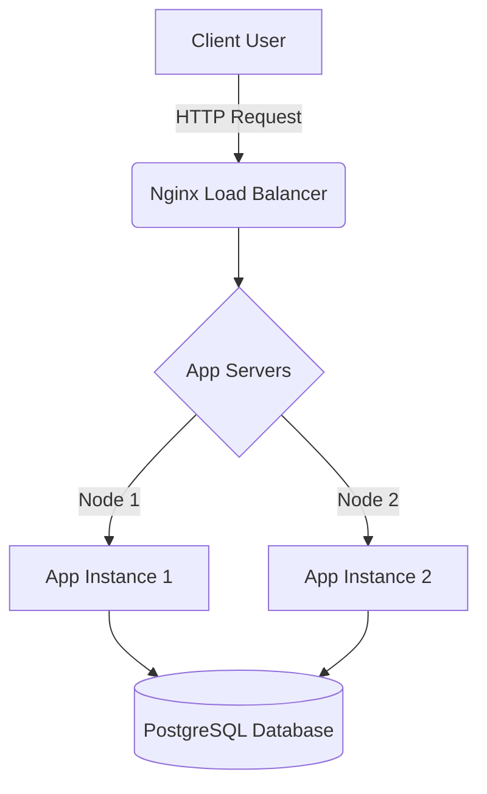

# Mermaid Diagram Test

Below is a test flowchart generated automatically using Mermaid.js:

```mermaid
graph TD;
    A[Client User] -->|HTTP Request| B(Nginx Load Balancer);
    B --> C{App Servers};
    C -->|Node 1| D[App Instance 1];
    C -->|Node 2| E[App Instance 2];
    D --> F[(PostgreSQL Database)];
    E --> F;
```
